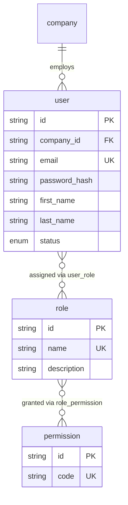

# Identity & Access

**Sprint 02.** Who can log in, and what they are allowed to do once they have.

This module answers two separate questions that are easy to conflate: *who is
this* (`user`) and *what may they click* (`role`, `permission`). See
[README.md](README.md#actor-fields-point-at-user-not-employee) for why actor
fields elsewhere in the schema point at `user`.

## Diagram

## Tables

### `user`

A login. One row per person (or service) that can sign in — not the same
thing as an employee. See [02-organization.md](02-organization.md#employee)
for the person's HR record, which is a separate table linked by
`employee.user_id`.

| Field | Type | Meaning |
| --- | --- | --- |
| `id` | String (uuid) | Primary key. |
| `company_id` | String (FK) | Which company this login belongs to. A user belongs to exactly one company — there is no cross-company login. |
| `email` | String, unique | The sign-in identifier. Unique across the whole system, not just within a company. |
| `password_hash` | String | A bcrypt/argon2 hash — never the plaintext password. |
| `first_name`, `last_name` | String | Display name shown in the UI (menus, "logged in as"). May differ from the legal name on the employee record. |
| `status` | Enum: `ACTIVE`, `INACTIVE` | Whether this login can currently authenticate. Set to `INACTIVE` to disable access without deleting the row — every audit trail, journal entry, and approval this person ever touched still points at this id. |
| `last_login_at` | DateTime, nullable | Set on successful sign-in. Null means the account has never been used. |
| `created_at`, `updated_at` | DateTime | Standard audit timestamps. |

*A user is never hard-deleted. Deactivate it instead — see
[README.md](README.md#master-data-is-deactivated-never-deleted).*

### `role`

A named bundle of permissions — e.g. "Administrator", "Finance Officer",
"Employee". Roles are shared across the whole company; they are not
per-department or per-user.

| Field | Type | Meaning |
| --- | --- | --- |
| `id` | String (uuid) | Primary key. |
| `name` | String, unique | The role's display name. Globally unique (not per company) — every tenant shares the same role catalog. |
| `description` | String, nullable | What this role is meant for, shown to an admin managing access. |

*A user can hold more than one role at once (e.g. "Employee" +
"Finance Officer") — see `user_role` below.*

### `permission`

A single, granular capability — e.g. `USER_CREATE`, `INVENTORY_ADJUST_
APPROVE`. Permissions are never assigned to a user directly; they are only
reached through a role.

| Field | Type | Meaning |
| --- | --- | --- |
| `id` | String (uuid) | Primary key. |
| `code` | String, unique | The machine-readable key that backend guards check against. Convention: `<MODULE>_<ACTION>`. |

*There is deliberately no `user_permission` table. `user → role → permission`
is the only path, so "why can this person do X?" always has one answer to
trace, not two.*

### `user_role`

Join table: which roles a user currently holds. No extra columns — see
[README.md](#) note below on why this stayed plain.

| Field | Type | Meaning |
| --- | --- | --- |
| `user_id` | String (FK) | The user. |
| `role_id` | String (FK) | The role granted to them. |

*Composite primary key `(user_id, role_id)` — a user cannot hold the same
role twice. This table intentionally has no `assigned_at` / `assigned_by`
columns; if you need an audit trail of role grants, that is what
`security_audit_log`'s `ROLE_ASSIGNED` event is for (see
[10-security.md](10-security.md)), not a column here.*

### `role_permission`

Join table: which permissions a role grants.

| Field | Type | Meaning |
| --- | --- | --- |
| `role_id` | String (FK) | The role. |
| `permission_id` | String (FK) | A permission included in that role. |

*Composite primary key `(role_id, permission_id)`.*
