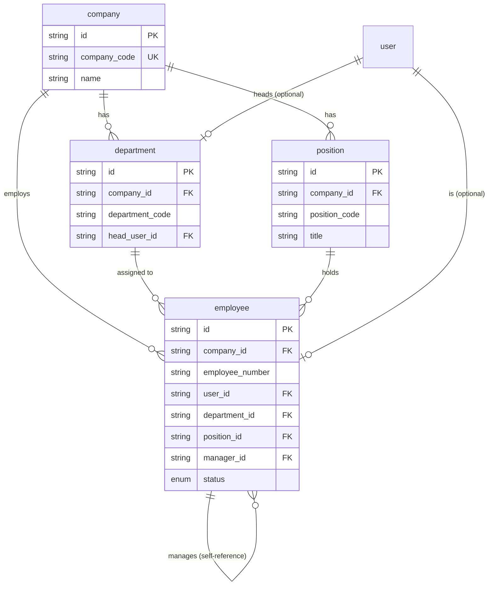

# Organization & Employees

**Sprint 03.** The tenant itself, its org structure, and the people who work
there.

`company` is the root of the entire multi-tenant model — its `id` is the
`company_id` that almost every other table in the schema carries. Everything
in this module exists to answer "who works here, in what job, reporting to
whom."

## Diagram

## Tables

### `company`

One row per tenant. This is a multi-company system — one database can hold
several unrelated businesses' data, and `company.id` is the tenant id
propagated as `company_id` onto nearly every other table in the schema.

| Field | Type | Meaning |
| --- | --- | --- |
| `id` | String (uuid) | Primary key, and the tenant id used everywhere else. |
| `company_code` | String, unique | A short human-readable code (e.g. `ACME01`). Globally unique — it identifies the tenant itself, before you even know which tenant you're in. |
| `name`, `legal_name` | String | Display name and the registered legal entity name (may differ, e.g. "Acme" vs. "Acme Trading Corp."). |
| `tax_number` | String, nullable | Tax registration number, printed on invoices. |
| `email`, `phone` | String, nullable | Company-level contact details. |
| `address_line1/2`, `city`, `country` | String, nullable | Company address, printed on documents. |
| `status` | Enum: `ACTIVE`, `INACTIVE` | Whether this tenant is currently active. |
| `created_at`, `updated_at` | DateTime | Standard audit timestamps. |

### `department`

An organizational unit within a company — e.g. "Finance", "Warehouse
Operations". Flat, not nested: every department belongs directly to the
company, with no parent/child department tree.

| Field | Type | Meaning |
| --- | --- | --- |
| `id` | String (uuid) | Primary key. |
| `company_id` | String (FK) | Which tenant this department belongs to. |
| `department_code` | String | Short code, unique within the company (two different companies can both have a `"SALES"` department). |
| `name`, `description` | String | Display name and optional explanation. |
| `head_user_id` | String (FK), nullable | The login of the person who heads this department. Points at `user`, not `employee` — see the note below. |
| `status` | Enum: `ACTIVE`, `INACTIVE` | Whether this department is currently in use. |

*`head_user_id` points at `user` rather than `employee` so it can be set
before `employee` even existed in the build order, and it stays consistent
with other "who's in charge" fields like `warehouse.manager_user_id`. It is
used by the workflow engine's `DEPARTMENT_HEAD` approval rule (see
[09-workflow.md](09-workflow.md)) to route department-level approvals — as
opposed to `employee.manager_id`, which routes personal approvals like leave
requests. In a small company these may be the same person; in a larger one
they are not.*

### `position`

A job title in the company-wide catalog — e.g. "Senior Accountant". Positions
belong to the company, not to a department, so the same title can be held by
people in different departments without duplicating rows.

| Field | Type | Meaning |
| --- | --- | --- |
| `id` | String (uuid) | Primary key. |
| `company_id` | String (FK) | Which tenant this position belongs to. |
| `position_code` | String | Short code, unique within the company. |
| `title`, `description` | String | The job title and an optional description. |
| `status` | Enum: `ACTIVE`, `INACTIVE` | Whether this title is currently offered. |

### `employee`

The person actually employed by the company — distinct from `user`, which is
just their login. An employee is never deleted: payroll, attendance, and
leave history all reference this row, and that history must survive after
someone leaves. Deactivating their `user` login is how you cut off access;
this row stays.

| Field | Type | Meaning |
| --- | --- | --- |
| `id` | String (uuid) | Primary key. |
| `company_id` | String (FK) | Which tenant this employee works for. |
| `employee_number` | String | Human-readable staff number, unique within the company. |
| `user_id` | String (FK), unique | The login this employee signs in with. Required — every employee must have an account (see the trade-off note below). |
| `department_id` | String (FK) | Which department they currently sit in. |
| `position_id` | String (FK) | Their job title, from the company's position catalog. |
| `manager_id` | String (FK), nullable | The employee they report to. Self-referencing — null means this person has no manager (typically the CEO). |
| `first_name`, `last_name` | String | The legal name, used on HR documents and payroll — may differ from `user.first_name/last_name`, which is just a display name for the login. |
| `hire_date` | Date | When employment started. |
| `end_date` | Date, nullable | When employment ended, if it has. |
| `employment_type` | Enum: `FULL_TIME`, `PART_TIME`, `CONTRACT`, `INTERN` | The nature of the contract. Independent of `status` — someone can be `FULL_TIME` and `PROBATION` at the same time. |
| `status` | Enum: `PROBATION`, `REGULAR`, `CONTRACTUAL`, `ON_LEAVE`, `SUSPENDED`, `RESIGNED`, `TERMINATED` | Where they currently are in the employment lifecycle. See [employment_history](03-human-resources.md#employment_history) for the log of how they got there. |
| `created_at`, `updated_at` | DateTime | Standard audit timestamps. |

*`manager_id` is what makes personal approval routing work: when Maria
submits a leave request, the approver is read straight off
`maria.manager_id`, rather than being chosen at submit time. It also drives
the reporting-line org chart and the workflow engine's `REPORTING_MANAGER`
rule.*

*A duplicate tenant fact exists here on purpose: `employee.company_id` should
always equal `employee.user.company_id`. Nothing in the database enforces
that they match — it is a service-layer rule. See
[invariants.md](invariants.md).*
