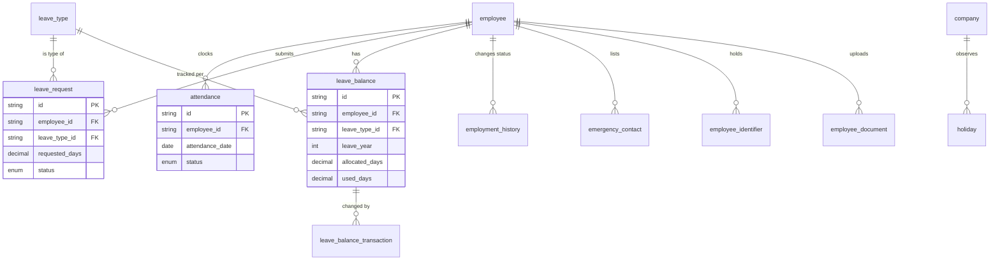

# Human Resources

**Sprint 04.** Attendance, leave, and the supporting records HR needs to keep
about an employee — emergency contacts, government IDs, uploaded documents,
and a history of every status change.

Two ledger patterns appear here for the first time in the schema and repeat
throughout the rest of it: an append-only history table backing a
point-in-time record (`employment_history`), and an append-only transaction
log backing a running counter (`leave_balance_transaction`). See
[README.md](README.md#ledger-tables-and-cached-counters).

## Diagram

## Tables

### `employment_history`

An append-only log of every status change an employee goes through —
`PROBATION → REGULAR`, `REGULAR → ON_LEAVE`, and so on. The first row for an
employee (with `from_status` null) records the hire itself.

| Field | Type | Meaning |
| --- | --- | --- |
| `id` | String (uuid) | Primary key. |
| `employee_id` | String (FK) | Whose status changed. |
| `from_status` | Enum, nullable | The status before the change. Null only for the very first row (the hire). |
| `to_status` | Enum | The status after the change. |
| `effective_date` | Date | When the change takes effect — may differ from `created_at` if the change is backdated or scheduled. |
| `reason` | String, nullable | Why the change happened. |
| `changed_by` | String (FK → `user`) | Who made the change. |
| `created_at` | DateTime | When the row was written. |

*Never updated or deleted — that is why this table has no `updated_at`.
`employee.status` is the current value; this table is how it got there.*

### `emergency_contact`

A person to call if something happens to the employee at work.

| Field | Type | Meaning |
| --- | --- | --- |
| `id` | String (uuid) | Primary key. |
| `employee_id` | String (FK) | Whose contact this is. |
| `name`, `relationship`, `phone`, `address` | String | The contact's details and their relationship to the employee. |
| `is_primary` | Boolean | Marks the contact to call first if there are several. |

### `employee_identifier`

A government-issued ID number — tax ID, national ID, passport, etc.

| Field | Type | Meaning |
| --- | --- | --- |
| `id` | String (uuid) | Primary key. |
| `employee_id` | String (FK) | Whose identifier this is. |
| `identifier_type` | Enum: `TAX`, `SOCIAL_SECURITY`, `NATIONAL_ID`, `PASSPORT`, `DRIVER_LICENSE`, `VOTER_ID` | What kind of ID this is. |
| `identifier_value` | String | The ID number itself. |
| `issued_date`, `expiry_date` | Date, nullable | When it was issued and when it expires, if applicable. |

*An employee can have more than one identifier of the same type (a dual
citizen holding two passports) — this is deliberate. If your business rule
needs exactly one tax ID per employee, enforce that in the service, not
here.*

### `employee_document`

A file uploaded to an employee's record — a contract, a certificate, a scan
of an ID.

| Field | Type | Meaning |
| --- | --- | --- |
| `id` | String (uuid) | Primary key. |
| `employee_id` | String (FK) | Whose file this is. |
| `document_type` | String | What kind of document this is (contract, certificate, etc.). |
| `file_name`, `file_path` | String | The original filename and where it is stored. |
| `uploaded_by` | String (FK → `user`) | Who uploaded it. |
| `uploaded_at` | DateTime | When it was uploaded. |

### `attendance`

One row per employee, per calendar day — whether they clocked in, when, and
for how long.

| Field | Type | Meaning |
| --- | --- | --- |
| `id` | String (uuid) | Primary key. |
| `employee_id` | String (FK) | Whose attendance record this is. |
| `attendance_date` | Date | The calendar day this row covers. |
| `clock_in_at`, `clock_out_at` | DateTime, nullable | The recorded times. Null `clock_out_at` means they haven't clocked out yet (or forgot to). |
| `worked_minutes` | Int, nullable | Stored, not calculated on read — written once at clock-out so payroll and dashboards don't have to recompute the interval on every query. |
| `status` | Enum: `PRESENT`, `INCOMPLETE`, `LATE`, `EARLY_DEPARTURE`, `ABSENT`, `ON_LEAVE` | The day's outcome. `ON_LEAVE` exists so an approved leave day has a row too, instead of leaving the day blank and ambiguous — see the note below. |
| `notes` | String, nullable | Free-text notes. |
| `original_clock_in_at`, `original_clock_out_at` | DateTime, nullable | The values *before* a correction was made, preserved so a manager's edit is never a silent change. Clock times feed payroll. |
| `corrected_by`, `corrected_at` | String (FK → `user`), DateTime, nullable | Who made a correction, and when. |
| `created_at`, `updated_at` | DateTime | Standard audit timestamps. |

*Unique on `(employee_id, attendance_date)` — an employee can only have one
attendance row per day, which makes a double clock-in structurally
impossible.*

*Without `ON_LEAVE`, a day with no attendance row is ambiguous: was it a
holiday, a weekend, approved leave, or did the employee simply not show up?
Writing an `ON_LEAVE` row when leave is approved removes that ambiguity —
every working day ends up with exactly one row saying what happened to it.*

### `holiday`

A date excluded from leave day-counting — a public holiday. Company-scoped,
because two companies operating in different countries observe different
holidays.

| Field | Type | Meaning |
| --- | --- | --- |
| `id` | String (uuid) | Primary key. |
| `company_id` | String (FK) | Which company observes this holiday. |
| `holiday_date` | Date | The date itself. |
| `name` | String | What the holiday is called. |

*This table has no pay-rate fields — payroll is out of scope for the whole
project. Its only job is to be excluded from the leave working-day
calculation: "count days from start to end, excluding weekends and
`holiday` rows." An empty holiday table silently over-counts every leave
request, so it must be seeded before leave requests are tested.*

### `leave_type`

A category of leave a company offers — Annual, Sick, Emergency, Maternity,
Unpaid, and so on.

| Field | Type | Meaning |
| --- | --- | --- |
| `id` | String (uuid) | Primary key. |
| `company_id` | String (FK) | Which company offers this leave type. |
| `code`, `name` | String | Short code and display name. |
| `is_paid` | Boolean | Whether taking this leave affects pay. |
| `requires_document` | Boolean | Whether supporting paperwork (e.g. a medical certificate) is required. |
| `max_consecutive_days` | Int, nullable | A cap on how many days can be requested in one go, if any. |
| `allows_backdating` | Boolean | Whether a request can be filed for dates already in the past. |
| `status` | Enum: `ACTIVE`, `INACTIVE` | Whether employees can currently request this type. |

### `leave_request`

A single request for time off.

| Field | Type | Meaning |
| --- | --- | --- |
| `id` | String (uuid) | Primary key. |
| `request_number` | String | Human-readable reference number (e.g. `LR-2026-00042`). |
| `employee_id` | String (FK) | Who is requesting leave. |
| `leave_type_id` | String (FK) | What kind of leave this is. |
| `start_date`, `end_date` | Date | The requested date range, inclusive. |
| `requested_days` | Decimal | The number of working days this covers — weekends and holidays already excluded. |
| `reason` | String, nullable | Why the employee is requesting leave. |
| `status` | Enum: `PENDING`, `APPROVED`, `REJECTED`, `CANCELLED` | Where the request currently stands. |
| `approver_id` | String (FK → `employee`), nullable | Who is (or was) responsible for deciding — normally read from `employee.manager_id` at submission time. |
| `decided_at`, `decision_comment` | DateTime, String, nullable | When a decision was made, and any comment left with it. |

### `leave_balance`

How many days of a given leave type an employee has left, for a given year.
One row per employee, per leave type, per year.

| Field | Type | Meaning |
| --- | --- | --- |
| `id` | String (uuid) | Primary key. |
| `employee_id` | String (FK) | Whose balance this is. |
| `leave_type_id` | String (FK) | Which leave type this balance tracks. |
| `leave_year` | Int | Which calendar year this balance applies to. |
| `allocated_days` | Decimal | Days granted for the year. |
| `used_days` | Decimal | Days already taken (approved leave requests). |
| `carried_over_days` | Decimal | Unused days brought forward from the previous year. |

*The days remaining is not a stored column — it is
`allocated_days + carried_over_days - used_days`, calculated when read.
Storing it as a fourth number would risk it disagreeing with the other
three. `used_days` must always equal the sum of this balance's
`leave_balance_transaction` rows — see [invariants.md](invariants.md).*

### `leave_balance_transaction`

An append-only ledger of every change to a leave balance — every allocation,
deduction, restoration, and adjustment, individually recorded.

| Field | Type | Meaning |
| --- | --- | --- |
| `id` | String (uuid) | Primary key. |
| `leave_balance_id` | String (FK) | Which balance this change applies to. |
| `transaction_type` | Enum: `ALLOCATION`, `DEDUCTION`, `RESTORATION`, `ADJUSTMENT`, `CARRY_OVER` | What kind of change this is. |
| `days` | Decimal | How many days this transaction moves. A deduction is a negative-effect entry in the running total, even though the stored value itself is a plain day count — the `transaction_type` says which direction it goes. |
| `reason` | String, nullable | Why this change happened. |
| `source_type`, `source_id` | String, nullable | What caused this transaction — e.g. the `leave_request` that was approved. |
| `created_by` | String (FK → `user`) | Who triggered the change (a manager approving, an admin correcting). |
| `created_at` | DateTime | When it happened. |

*Never updated or deleted — that is why this table has no `updated_at`. If a
leave request for 3 days is approved and later cancelled, that is two rows
here (a `DEDUCTION` then a `RESTORATION`), not one row edited back to zero.
This is what lets you answer "why does Maria have 12 days left?" by listing
every transaction, rather than trusting a single number.*
