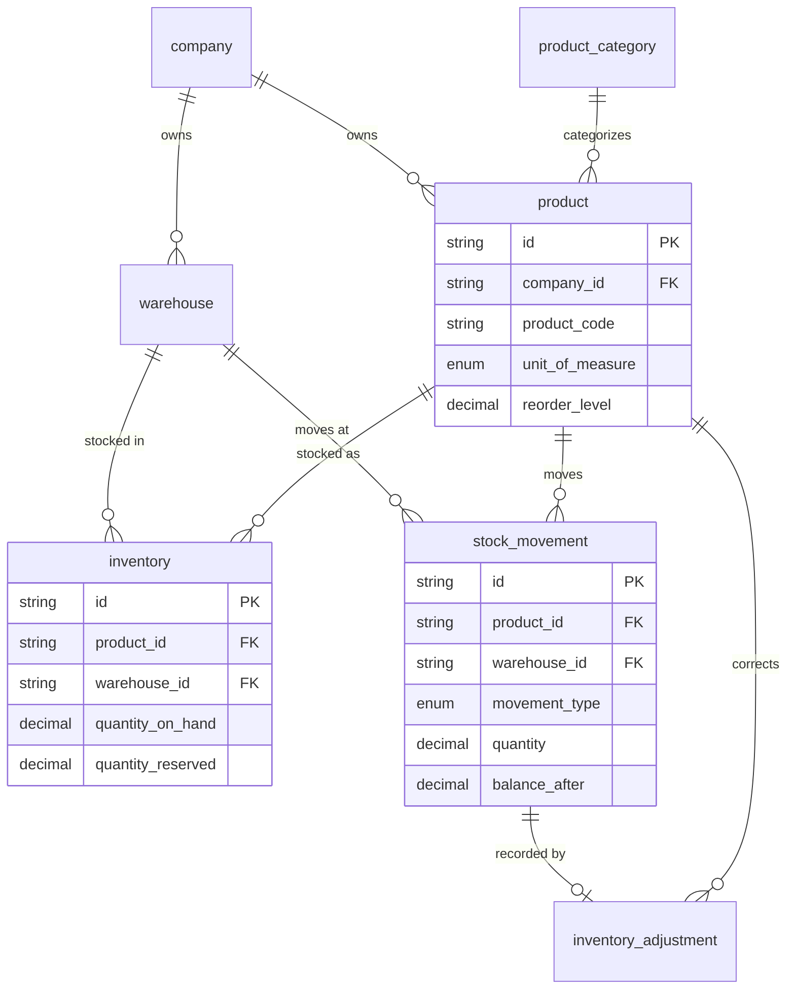

# Inventory

**Sprint 05.** What you sell, where it's stored, and how much of it you have.

The central pattern here — a fast counter (`inventory`) backed by a signed,
append-only ledger (`stock_movement`) — is reused with small variations
throughout the rest of the schema (leave balances, delivered/received
quantities, financial balances). Understanding it here makes every later
module easier to read. See
[README.md](README.md#ledger-tables-and-cached-counters).

## Diagram

## Tables

### `product_category`

A flat grouping for products — e.g. "Electronics", "Office Supplies". Not
nested; every category belongs directly to the company.

| Field | Type | Meaning |
| --- | --- | --- |
| `id` | String (uuid) | Primary key. |
| `company_id` | String (FK) | Which company owns this category. |
| `category_code`, `name`, `description` | String | Short code, display name, optional description. |
| `status` | Enum: `ACTIVE`, `INACTIVE` | Whether this category is currently in use. |

### `product`

Something the company buys and/or sells — a physical item tracked in
inventory.

| Field | Type | Meaning |
| --- | --- | --- |
| `id` | String (uuid) | Primary key. |
| `company_id` | String (FK) | Which company owns this product. |
| `product_code` | String | Short code (SKU), unique within the company. |
| `name`, `description` | String | Display name and optional description. |
| `category_id` | String (FK) | Which category this product belongs to. |
| `unit_of_measure` | Enum: `PIECE`, `BOX`, `CARTON`, `KILOGRAM`, `GRAM`, `LITER`, `METER`, `PACK` | How this product is counted or measured. |
| `barcode` | String, nullable, unique | For scanning at point of sale or receiving. |
| `reorder_level` | Decimal | Stock threshold below which the product should be reordered. |
| `reorder_quantity` | Decimal | How much to reorder when that threshold is hit. |
| `status` | Enum: `ACTIVE`, `INACTIVE` | Whether this product can currently be bought or sold. |

*Quantity-related fields are `Decimal`, not `Int`, because `unit_of_measure`
includes fractional units like kilograms and liters — 2.5 kg is a valid
quantity and must not be rounded to 2 or 3.*

### `warehouse`

A physical location where stock is stored.

| Field | Type | Meaning |
| --- | --- | --- |
| `id` | String (uuid) | Primary key. |
| `company_id` | String (FK) | Which company owns this warehouse. |
| `warehouse_code`, `name` | String | Short code and display name. |
| `address_line1/2`, `city`, `country`, `phone` | String, nullable | Physical location and contact details. |
| `manager_user_id` | String (FK → `user`), nullable | Who is responsible for this warehouse. |
| `is_default` | Boolean | Marks the warehouse used automatically when none is specified. |
| `status` | Enum: `ACTIVE`, `INACTIVE` | Whether this warehouse is currently in operation. |

### `inventory`

The current stock position — how much of a product is in a warehouse, right
now.

| Field | Type | Meaning |
| --- | --- | --- |
| `id` | String (uuid) | Primary key. |
| `product_id` | String (FK) | Which product this row tracks. |
| `warehouse_id` | String (FK) | Which warehouse this row tracks. |
| `quantity_on_hand` | Decimal | Physical stock currently in this warehouse. This is a cached counter — it must always equal the sum of that product/warehouse's `stock_movement` rows. |
| `quantity_reserved` | Decimal | Stock promised to a confirmed sales order but not yet shipped. |

*Unique on `(product_id, warehouse_id)` — one row per product per warehouse.
"Available to sell" (`quantity_on_hand - quantity_reserved`) is not a stored
column; it is calculated when read, so it can never disagree with the two
numbers it comes from. Concurrent sales are protected by a conditional
update in the service (`UPDATE ... WHERE quantity_on_hand >= n`), not by a
version column — see [invariants.md](invariants.md).*

### `stock_movement`

An append-only ledger: every single change to stock, ever, one row each.

| Field | Type | Meaning |
| --- | --- | --- |
| `id` | String (uuid) | Primary key. |
| `movement_number` | String | Human-readable reference number. |
| `product_id`, `warehouse_id` | String (FK) | What moved, and where. |
| `movement_type` | Enum: `STOCK_IN`, `STOCK_OUT`, `TRANSFER_IN`, `TRANSFER_OUT`, `ADJUSTMENT` | What kind of event caused this movement. |
| `quantity` | Decimal | Signed — positive adds stock, negative removes it. This means the running balance for a product/warehouse is a plain `SUM(quantity)`, with no `CASE` logic needed for direction. |
| `balance_after` | Decimal | The `quantity_on_hand` value immediately after this movement was applied — a point-in-time snapshot for audit purposes. |
| `reference_type`, `reference_id` | String, nullable | What business document caused this movement (a delivery, a goods receipt, an adjustment). A warehouse transfer writes two rows sharing the same `reference_id`. |
| `reason` | String, nullable | Free-text explanation, mainly used for manual or adjustment movements. |
| `performed_by` | String (FK → `user`) | Who triggered the movement. |
| `created_at` | DateTime | When it happened. |

*Never updated or deleted. This table is the source of truth;
`inventory.quantity_on_hand` is a cache of its sum, and the two must be
written in the same database transaction — see
[invariants.md](invariants.md).*

### `inventory_adjustment`

A correction to stock — a physical count discrepancy, damage, theft, or a
data-entry fix. Requires approval before it changes actual stock, because
write-offs are a common path for inventory fraud.

| Field | Type | Meaning |
| --- | --- | --- |
| `id` | String (uuid) | Primary key. |
| `adjustment_number` | String | Human-readable reference number. |
| `product_id`, `warehouse_id` | String (FK) | What is being adjusted, and where. |
| `recorded_quantity` | Decimal | What the system currently says is in stock. |
| `counted_quantity` | Decimal | What was actually found (e.g. during a physical count). |
| `variance_quantity` | Decimal | The difference between the two — stored, not recalculated. |
| `reason_code` | Enum: `PHYSICAL_COUNT`, `DAMAGE`, `EXPIRY`, `THEFT_OR_LOSS`, `SAMPLE_OR_PROMOTION`, `DATA_ENTRY_CORRECTION`, `OTHER` | Why the variance exists. |
| `notes` | String, nullable | Additional explanation. |
| `status` | Enum: `PENDING`, `APPROVED`, `REJECTED` | Whether this adjustment has been approved to actually change stock. |
| `created_by` | String (FK → `user`) | Who reported the discrepancy. |
| `approved_by` | String (FK → `user`), nullable | Who approved it. Must be a different person from `created_by` — a control against one person both reporting and approving their own write-off. Enforced in the service, not the database. |
| `decided_at`, `decision_comment` | DateTime, String, nullable | When a decision was made, and any comment. |
| `stock_movement_id` | String (FK), nullable, unique | The ledger row this adjustment produced — set only once approved. Stays null while the adjustment is pending. |

*Nothing happens to actual stock until `status` becomes `APPROVED`, at which
point a `stock_movement` row is created and linked back here. A rejected or
still-pending adjustment leaves `quantity_on_hand` untouched.*
