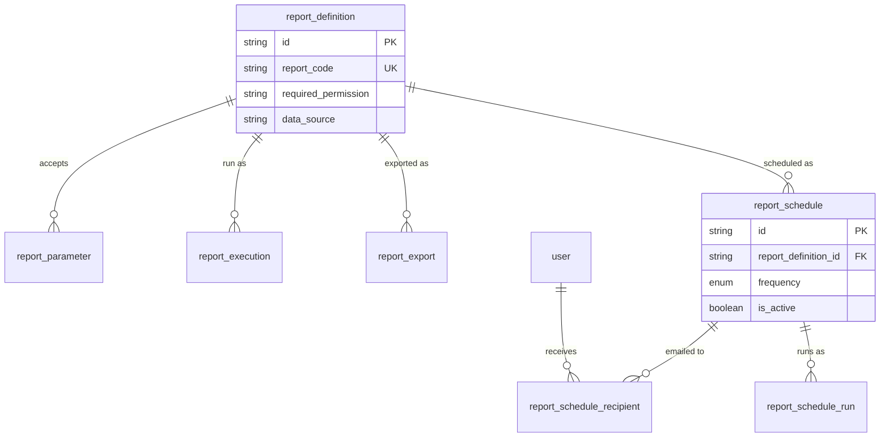

# Reporting & Analytics

**Sprint 09.** The report catalog, and the infrastructure to run, export, and
schedule reports. **No table in this module stores a report's actual
results** — every report is a query over the transactional tables described
in the other modules, computed when it runs. Duplicating sales or ledger data
into a reporting table would create a second copy of the truth that could
drift from the first.

## Diagram

## Tables

### `report_definition`

The report catalog: which reports exist, and what they need to run.

| Field | Type | Meaning |
| --- | --- | --- |
| `id` | String (uuid) | Primary key. |
| `report_code` | String | Short identifier, unique within the company. |
| `name`, `category`, `description` | String | Display name, grouping, and explanation. |
| `required_permission` | String, nullable | The permission a user needs to see this report — the report menu a user sees is derived from this, not hardcoded per user. |
| `data_source` | String | An identifier for the query or view that actually produces this report's data. |
| `status` | Enum: `ACTIVE`, `INACTIVE` | Whether this report currently appears in the menu. |

### `report_parameter`

An input field a report accepts — a date range, a customer, a warehouse.

| Field | Type | Meaning |
| --- | --- | --- |
| `id` | String (uuid) | Primary key. |
| `report_definition_id` | String (FK) | Which report this parameter belongs to. |
| `parameter_key`, `label` | String | The internal key, and the label shown to the user. |
| `data_type` | Enum: `DATE`, `STRING`, `NUMBER`, `BOOLEAN`, `REFERENCE` | What kind of value this parameter expects. |
| `is_required` | Boolean | Whether the report can run without this parameter. |
| `default_value` | String, nullable | Pre-filled value, if any. |
| `display_order` | Int | Order this field appears in the report's input form. |

### `report_execution`

A record of a report actually being run.

| Field | Type | Meaning |
| --- | --- | --- |
| `id` | String (uuid) | Primary key. |
| `report_definition_id` | String (FK) | Which report was run. |
| `executed_by` | String (FK → `user`) | Who ran it. |
| `parameters` | Json, nullable | A snapshot of the exact inputs this run was given — recorded as "what was asked," not as a structure meant to be queried. |
| `row_count`, `duration_ms` | Int, nullable | How much data came back, and how long it took. |
| `status` | Enum: `SUCCESS`, `FAILED` | Whether the run completed. |
| `error` | String, nullable | The failure reason, if it failed. |
| `executed_at` | DateTime | When it ran. |

*Reports are how data leaves the system, so every run is logged here. Sprint
11's security review reads this table to answer questions like "who exported
customer contact data, and when?"*

### `report_export`

A background job for generating a downloadable file (CSV/PDF) from a report
— tracked as a job because a large export cannot finish inside a single web
request.

| Field | Type | Meaning |
| --- | --- | --- |
| `id` | String (uuid) | Primary key. |
| `report_definition_id` | String (FK) | Which report is being exported. |
| `requested_by` | String (FK → `user`) | Who asked for the export. |
| `parameters` | Json, nullable | The inputs used for this export. |
| `format` | Enum: `CSV`, `PDF` | The output file format. |
| `status` | Enum: `PROCESSING`, `COMPLETED`, `FAILED` | Where the job stands. The client polls this. |
| `file_path` | String, nullable | Where the finished file is stored — null until the job completes. |
| `row_count` | Int, nullable | How many rows the export contained. |
| `error` | String, nullable | The failure reason, if it failed. |
| `requested_at`, `completed_at` | DateTime, DateTime nullable | When it was requested, and when it finished. |

### `report_schedule` / `report_schedule_recipient` / `report_schedule_run`

A report that runs automatically on a recurring basis and is emailed to a
list of people.

**`report_schedule`**

| Field | Type | Meaning |
| --- | --- | --- |
| `id` | String (uuid) | Primary key. |
| `report_definition_id` | String (FK) | Which report to run. |
| `frequency` | Enum: `DAILY`, `WEEKLY`, `MONTHLY` | How often to run it. |
| `parameters` | Json, nullable | The fixed inputs to use each time. |
| `export_format` | Enum: `CSV`, `PDF` | The format to email out. |
| `is_active` | Boolean | Whether this schedule currently runs. |
| `next_run_at` | DateTime, nullable | When the next run is due. |
| `created_by` | String (FK → `user`) | Who set up the schedule. |

**`report_schedule_recipient`** (who receives it)

| Field | Type | Meaning |
| --- | --- | --- |
| `report_schedule_id` | String (FK) | Which schedule this is a recipient of. |
| `user_id` | String (FK) | Who receives it. |

*A join table with a real foreign key to `user`, rather than an array of
user ids on the schedule. This means a deactivated or deleted user cannot
silently linger on a distribution list, and "which reports does this person
receive?" is an ordinary query instead of scanning every schedule's array
column.*

**`report_schedule_run`** (execution history of the schedule)

| Field | Type | Meaning |
| --- | --- | --- |
| `id` | String (uuid) | Primary key. |
| `report_schedule_id` | String (FK) | Which schedule this run belongs to. |
| `status` | Enum: `SUCCESS`, `FAILED`, `RETRYING` | The outcome of this specific run. |
| `attempt_count` | Int | How many times this run has been retried. |
| `error` | String, nullable | The failure reason, if it failed. |
| `started_at`, `completed_at` | DateTime, DateTime nullable | When the run started and finished. |

### `kpi_definition`

Display metadata for a KPI shown on a dashboard — **not** the formula
itself.

| Field | Type | Meaning |
| --- | --- | --- |
| `id` | String (uuid) | Primary key. |
| `kpi_code` | String | Short identifier, unique within the company. |
| `name`, `description`, `unit` | String | Display name, explanation, and unit (%, $, days). |
| `comparison_period` | String, nullable | What this KPI is compared against (e.g. "previous period"). |
| `status` | Enum: `ACTIVE`, `INACTIVE` | Whether this KPI currently appears on dashboards. |

*The actual calculation for each KPI lives in application code, not as a
formula string in this table. A formula stored as text would be
untested, unreviewable in a Pull Request, and would have to be evaluated at
runtime against live data — a real risk when the formula came from a
database row rather than a code review.*
