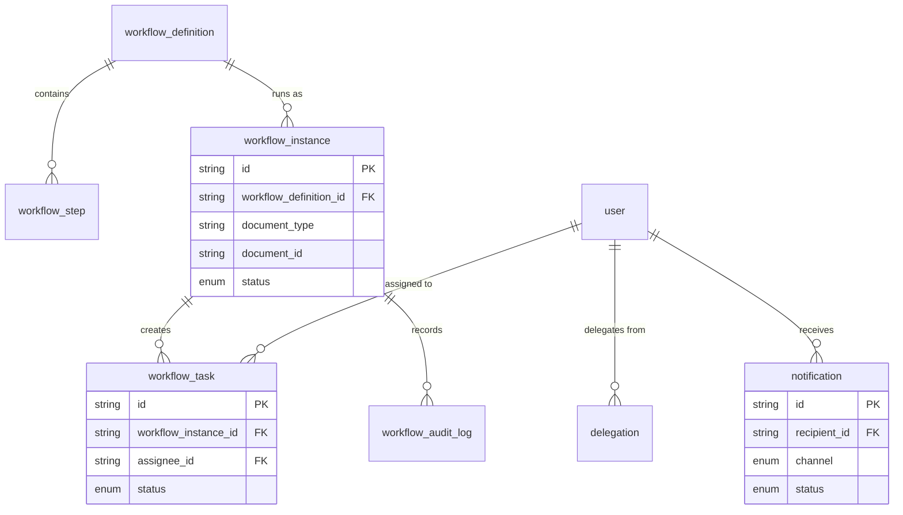

# Workflow & Notifications

**Sprint 10.** A general-purpose approval engine that can route *any*
document type — not just purchase requisitions. Leave requests, requisitions,
and journal entries can all share this one mechanism instead of each module
hardcoding its own approval chain, the way [Purchasing](06-purchasing.md)'s
`approval_limit` / `requisition_approval` originally did.

Also covers notifications — the outbox that turns workflow events (and other
system events) into messages a user actually sees.

## Diagram

## Tables

### `workflow_definition`

A named approval process for a document type — e.g. "Purchase Requisition
Approval". Versioned, so an already-running approval never has its rules
rewritten out from under it.

| Field | Type | Meaning |
| --- | --- | --- |
| `id` | String (uuid) | Primary key. |
| `code`, `name` | String | Identifier and display name. |
| `document_type` | String | Which kind of document this workflow applies to (e.g. `"PurchaseRequisition"`, `"LeaveRequest"`). |
| `version` | Int | The version of this workflow's rules. |
| `is_active` | Boolean | Whether new documents currently use this workflow. |
| `created_by` | String (FK → `user`) | Who authored it. |

*A `workflow_instance` pins the exact version it started under. Editing a
workflow's steps creates a new version rather than changing the old one, so
an in-flight approval never has its rules rewritten halfway through.*

### `workflow_step`

One stage in an approval chain — who must approve, and under what
conditions.

| Field | Type | Meaning |
| --- | --- | --- |
| `id` | String (uuid) | Primary key. |
| `workflow_definition_id` | String (FK) | Which workflow this step belongs to. |
| `step_order` | Int | This step's position in the chain. |
| `approver_rule_type` | Enum: `REPORTING_MANAGER`, `DEPARTMENT_HEAD` | How to find the actual approver. Both rules are resolved at runtime — from `employee.manager_id` or `department.head_user_id` — rather than naming a specific person, so routing stays correct automatically when someone changes jobs. |
| `min_amount`, `max_amount` | Decimal, nullable | The amount range this step applies to. Both null means the step always applies. This is what replaces the amount thresholds in Sprint 07's `approval_limit`. |
| `escalation_hours` | Int, nullable | How long before an unactioned task at this step escalates. |

### `workflow_instance`

One actual running (or completed) approval process, attached to one real
document.

| Field | Type | Meaning |
| --- | --- | --- |
| `id` | String (uuid) | Primary key. |
| `workflow_definition_id` | String (FK) | Which workflow (and version) this instance is running. |
| `document_type`, `document_id` | String | Which document this approval is for. |
| `current_step_order` | Int | Which step the approval is currently waiting on. |
| `status` | Enum: `PENDING`, `IN_PROGRESS`, `APPROVED`, `REJECTED`, `CANCELLED`, `ESCALATED` | Where the approval stands. |
| `started_by`, `started_at` | String (FK → `user`), DateTime | Who submitted the document, and when. |
| `completed_at` | DateTime, nullable | When the approval finished, one way or another. |

*`document_type` + `document_id` is a loose, untyped reference rather than a
real foreign key — deliberately. The set of documents that can go through
approval grows with every new module, and a dedicated foreign key column per
document type would grow without end. The trade-off is real: nothing in the
database stops `document_id` from pointing at a row that no longer exists.
Deleting a document must cancel its workflow instances in the same
transaction — see [invariants.md](invariants.md). Contrast this with
`payment.customer_id` / `supplier_id`, where the party is always one of
exactly two known tables and gets two real foreign keys instead.*

### `workflow_task`

One person's turn to act, at one step, on one instance.

| Field | Type | Meaning |
| --- | --- | --- |
| `id` | String (uuid) | Primary key. |
| `workflow_instance_id` | String (FK) | Which approval this task belongs to. |
| `step_order` | Int | Which step this task is for. |
| `assignee_id` | String (FK → `user`) | Who needs to act. |
| `delegated_from_id` | String (FK → `user`), nullable | If this task arrived because of a delegation, who it was originally assigned to. This keeps a stand-in's decision traceable to whose authority it was made under. |
| `status` | Enum: `OPEN`, `COMPLETED`, `DELEGATED`, `EXPIRED` | Where this task stands. |
| `decision`, `comment` | String, nullable | The decision made, and any comment. |
| `due_at`, `completed_at` | DateTime, nullable | When this task is due, and when it was actioned. |

*This table is what a "task inbox" screen queries: everything with
`status = OPEN` and `assignee_id = <current user>`.*

### `workflow_audit_log`

An append-only history of everything that happened to a workflow instance —
routing, decisions, delegations, escalations.

| Field | Type | Meaning |
| --- | --- | --- |
| `id` | String (uuid) | Primary key. |
| `workflow_instance_id` | String (FK) | Which instance this event belongs to. |
| `actor_id` | String (FK → `user`), nullable | Who caused this event. Null for escalations, which are raised by a timer rather than a person. |
| `action` | Enum: `ROUTED`, `APPROVED`, `REJECTED`, `DELEGATED`, `ESCALATED`, `CANCELLED` | What happened. |
| `from_status`, `to_status` | String, nullable | The instance's status before and after this event. |
| `comment` | String, nullable | Any note left with the action. |
| `created_at` | DateTime | When it happened. |

*Never updated or deleted — that's why there's no `updated_at`.*

### `delegation`

A temporary reassignment of someone's approval duties while they're away.

| Field | Type | Meaning |
| --- | --- | --- |
| `id` | String (uuid) | Primary key. |
| `delegator_id` | String (FK → `user`) | Whose approvals are being reassigned. |
| `delegate_id` | String (FK → `user`) | Who is standing in for them. |
| `start_date`, `end_date` | Date | The date range this delegation is active for. |

*Two active delegations for the same `delegator_id` should never have
overlapping date ranges — enforced in the service, not the database. See
[invariants.md](invariants.md).*

### `notification`

An outbox: a message queued to be delivered to a user, and its delivery
outcome.

| Field | Type | Meaning |
| --- | --- | --- |
| `id` | String (uuid) | Primary key. |
| `recipient_id` | String (FK → `user`) | Who this message is for. |
| `event_code` | String | What triggered this notification (e.g. `"workflow.task.assigned"`). |
| `channel` | Enum: `IN_APP`, `EMAIL` | How this message is delivered. |
| `subject`, `body` | String, nullable / String | The message content. |
| `status` | Enum: `QUEUED`, `SENT`, `FAILED` | Delivery outcome. |
| `retry_count` | Int | How many delivery attempts have been made. |
| `error` | String, nullable | The failure reason, if delivery failed. |
| `sent_at`, `read_at` | DateTime, nullable | When it was sent, and when the recipient read it (in-app only). |

*Rows are written `QUEUED` and a background sender moves them to `SENT` or
`FAILED`. Delivery fails routinely (a bounced email, a down mail server), so
`retry_count` and `error` exist to make a failed send visible and retryable
rather than silently lost.*
