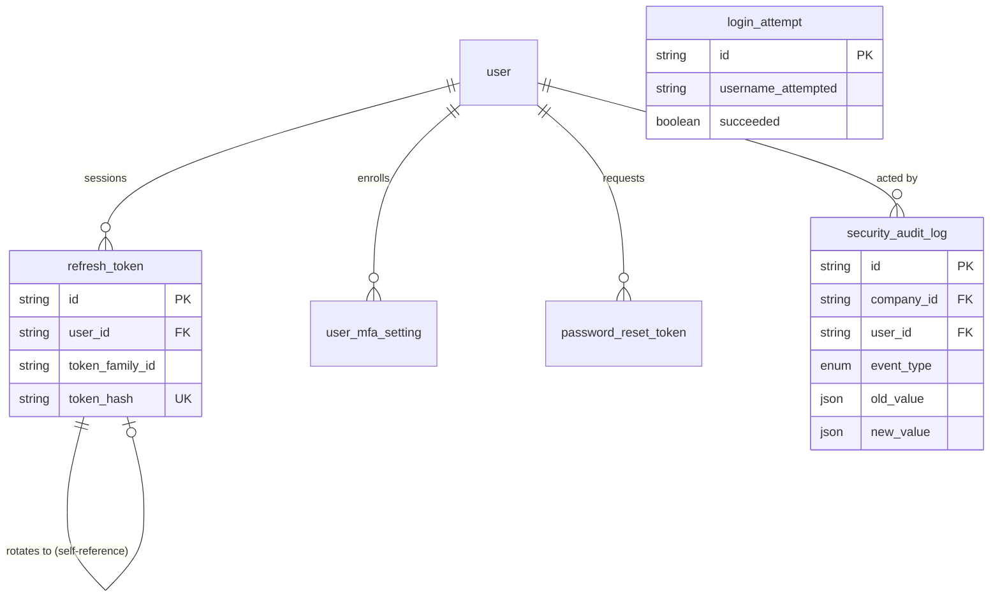

# Security

**Sprint 11.** Authentication infrastructure and the security audit trail:
sessions, login attempts, multi-factor authentication, and a log of
security-relevant events that the per-module history tables (like
`employment_history` or `journal_entry` reversals) don't cover — logins,
access grants, and edits to sensitive data like a supplier's bank account.

**These tables are the one deliberate exception to the "every table has a
`company_id`" rule** — see the note below.

## Diagram

## Why These Tables Skip `company_id`

Every other table in this schema carries a `company_id` because it belongs
to a known tenant. These four don't, for a reason specific to authentication:

- A **failed login** happens before the system knows who the person is — the
  email they typed may not belong to any account at all, so there is no
  tenant to attach it to.
- A **refresh token** is looked up by its hash, not by company, when
  validating a session.

`security_audit_log` is the one exception within the exception: it keeps a
**nullable** `company_id`, so events that do have a known tenant (most of
them) can still be queried per-company, while events that don't (a failed
login for an unrecognized email) simply leave it null.

## Tables

### `security_audit_log`

A record of security-relevant events across the whole system — logins,
access grants, and changes to sensitive data.

| Field | Type | Meaning |
| --- | --- | --- |
| `id` | String (uuid) | Primary key. |
| `company_id` | String (FK), nullable | The tenant this event relates to, where known. |
| `user_id` | String (FK → `user`), nullable | Who caused this event, where known. Null for a failed login against an unrecognized email. |
| `event_type` | Enum: `LOGIN_SUCCEEDED`, `LOGIN_FAILED`, `LOGOUT`, `SESSION_REVOKED`, `PASSWORD_CHANGED`, `PASSWORD_RESET_REQUESTED`, `PASSWORD_RESET_COMPLETED`, `MFA_ENROLLED`, `MFA_DISABLED`, `USER_CREATED`, `USER_DEACTIVATED`, `ROLE_ASSIGNED`, `ROLE_REVOKED`, `PERMISSION_CHANGED`, `SENSITIVE_DATA_VIEWED`, `SENSITIVE_DATA_CHANGED` | What happened. |
| `entity_type`, `entity_id` | String, nullable | Which record this event is about, if it's about a specific one (e.g. `entity_type = "supplier_bank_detail"`). |
| `old_value`, `new_value` | Json, nullable | The value before and after the change, for `SENSITIVE_DATA_CHANGED` events. This is what turns "someone edited the supplier's bank details" into "the account number changed from X to Y" — the difference between detecting fraud and merely knowing something happened. |
| `detail` | String, nullable | Free-text context. |
| `ip_address`, `user_agent` | String, nullable | Where the request came from. |
| `created_at` | DateTime | When it happened. |

*Never updated or deleted — that is why this table has no `updated_at`. An
audit log that can be edited after the fact is not evidence of anything.*

### `refresh_token`

A long-lived session credential used to obtain new short-lived access
tokens.

| Field | Type | Meaning |
| --- | --- | --- |
| `id` | String (uuid) | Primary key. |
| `user_id` | String (FK → `user`) | Whose session this is. |
| `token_family_id` | String | Groups a chain of tokens produced by rotating the same original session. |
| `token_hash` | String, unique | A hash of the token — never the token itself. A leaked database must not hand out working sessions. |
| `issued_at`, `expires_at` | DateTime | The token's validity window. |
| `revoked_at` | DateTime, nullable | When (and whether) this token was manually invalidated. |
| `replaced_by_id` | String (FK), nullable, unique | The token this one was rotated into, if it has been. |
| `ip_address`, `user_agent` | String, nullable | Where the session was created. |

*If an already-revoked token is ever presented for use, that is a strong
signal the token was stolen and reused. The correct response is to revoke
the **entire `token_family_id`**, not just that one token — the family
groups every token descended from the same original login.*

### `login_attempt`

Every attempt to log in, successful or not — deliberately not linked to
`user`.

| Field | Type | Meaning |
| --- | --- | --- |
| `id` | String (uuid) | Primary key. |
| `username_attempted` | String | The email/username that was typed, whether or not it belongs to a real account. |
| `ip_address`, `user_agent` | String, nullable | Where the attempt came from. |
| `succeeded` | Boolean | Whether the attempt succeeded. |
| `failure_reason` | String, nullable | Why it failed, if it did. |
| `attempted_at` | DateTime | When the attempt happened. |

*This table has no foreign key to `user` on purpose — recording attempts
against usernames that don't exist is the whole point, since that is exactly
what a credential-stuffing or brute-force attack looks like. It feeds rate
limiting and account lockout logic.*

### `user_mfa_setting`

A multi-factor authentication method enrolled for a user.

| Field | Type | Meaning |
| --- | --- | --- |
| `id` | String (uuid) | Primary key. |
| `user_id` | String (FK) | Whose MFA setting this is. |
| `method` | Enum: `TOTP`, `SMS`, `EMAIL` | The type of second factor. |
| `secret` | String | The seed used to generate valid codes. Must be encrypted at rest — a plaintext value here defeats the entire purpose of having MFA. |
| `is_enabled` | Boolean | Whether this method is currently active. |
| `enrolled_at` | DateTime, nullable | When the user completed enrollment. |

### `password_reset_token`

A single-use credential emailed to a user who requested a password reset.

| Field | Type | Meaning |
| --- | --- | --- |
| `id` | String (uuid) | Primary key. |
| `user_id` | String (FK) | Whose password is being reset. |
| `token_hash` | String, unique | A hash of the token that was emailed — never the token itself, for the same reason as `refresh_token`. |
| `expires_at` | DateTime | When this token stops being valid. |
| `used_at` | DateTime, nullable | Set the moment the token is used, making it single-use. A reset link found later in an inbox or a proxy log cannot be replayed. |
| `ip_address` | String, nullable | Where the reset was requested from. |
