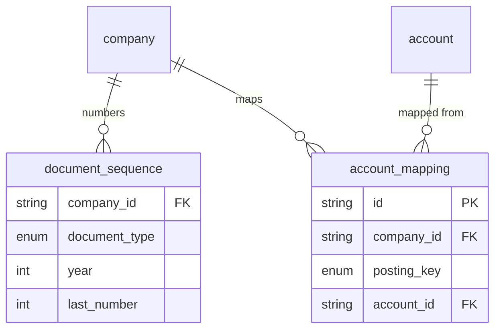

# Platform Infrastructure

Two tables that don't belong to any single sprint's business module, but
that other modules' *specified* features cannot actually be built without.
Neither appears in the sprint docs' entity lists — they were added after a
gap review found that eleven+ document numbers had no generator, and that
auto-posting to the ledger had nowhere to look up which account to use.

## Diagram

## Tables

### `document_sequence`

Generates the next number for a human-readable document reference — the
counter behind `SO-2026-00042` and its thirteen siblings across the schema
(sales orders, invoices, purchase orders, journal entries, and so on).

| Field | Type | Meaning |
| --- | --- | --- |
| `company_id` | String (FK) | Which company this counter belongs to. Part of the primary key. |
| `document_type` | Enum: `EMPLOYEE`, `LEAVE_REQUEST`, `STOCK_MOVEMENT`, `INVENTORY_ADJUSTMENT`, `SALES_QUOTATION`, `SALES_ORDER`, `DELIVERY`, `SALES_INVOICE`, `PURCHASE_REQUISITION`, `PURCHASE_ORDER`, `GOODS_RECEIPT`, `SUPPLIER_INVOICE`, `JOURNAL_ENTRY`, `PAYMENT` | Which kind of document this counter numbers. Part of the primary key. |
| `year` | Int | The calendar year this counter applies to — numbering resets each year. Part of the primary key. |
| `last_number` | Int | The last number issued. The next document gets `last_number + 1`. |

*Primary key is the combination of `(company_id, document_type, year)`. A
plain database auto-increment sequence cannot serve this purpose, because
numbering here is per-company **and** resets every year — a single global
sequence would either leak how many total orders exist across all tenants,
or never reset annually. Several sprint issues (e.g. issue-038, issue-039)
explicitly require that numbers come from "a sequence or locked counter,
never by counting rows" — counting existing rows races under concurrent
requests and reuses numbers when a row is later cancelled. The correct
usage is to read this row with a row lock (`SELECT ... FOR UPDATE`) inside
the same database transaction that creates the numbered document, so two
concurrent requests can never be handed the same number.*

### `account_mapping`

Tells the system which ledger account to post to for a given kind of
transaction — the bridge between the business modules and
[Finance](07-finance.md).

| Field | Type | Meaning |
| --- | --- | --- |
| `id` | String (uuid) | Primary key. |
| `company_id` | String (FK) | Which company this mapping applies to. |
| `posting_key` | Enum: `ACCOUNTS_RECEIVABLE`, `ACCOUNTS_PAYABLE`, `SALES_REVENUE`, `SALES_DISCOUNT`, `INVENTORY`, `COST_OF_GOODS_SOLD`, `CASH`, `BANK`, `DEFAULT_EXPENSE`, `RETAINED_EARNINGS` | A named posting purpose — "where does a sales invoice's AR line go?" |
| `account_id` | String (FK → `account`) | The specific account (from that company's own chart of accounts) to use for this purpose. |
| `updated_by` | String (FK → `user`) | Who last changed this mapping. |

*Unique on `(company_id, posting_key)` — one mapping per purpose, per
company. This has to be a table rather than a hardcoded account code in
application code, because the chart of accounts is per-company: two tenants
can (and will) use different account codes for the same real-world purpose,
so a constant like `'1100'` would be correct for one company and wrong for
every other. This is also where Sprint 08's "a single default expense
account is assumed for now" (issue-054) actually lives — as the
`DEFAULT_EXPENSE` row.*
